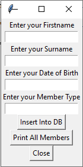

# sqlite Example - Save and Retrieve data from a sqlite database
Once you have cloned this repo, run the CreateTennisclubDB.py to create the tennisclub database.

When the tennisclub.db file has been created installed you can try the programs insertTCMemberTest.py and printAllMembers.py

The programs should insert a new member of the tennis club into the table called member and print all the members of the club to the screen.

# Part 1

Adapt the MyFirstGUI GUI Interface included in the repo to allow it to capture details about a new member of the Tennisclub database as follows

Make sure to add appropriate comments to your program at the beginning indicating the filename, a description, the date and your name.

When you have completed Part 1 make sure to do a git add, git commit and git push.

# Part 2

Take example SQL code from the insertTCMemberTest.py and add a function to the GUI Class you have built in part 1 so that when the button is clicked the details of the new Tennis Club member which the user entered are inserted into the Member table of the TennisClub Database.

To do this, you will need to call the get() method on each of the TKinter entry object to get the values entered by the user, assign the results of each of those get functions to appropriate simple python variables.

Construct a valid SQL insert into statement by concatenating the the variables into the correct positions together with single quotes.

Print the SQL String to make sure it looks correct.

When you are happy the SQL would work, add the lines which will execute the SQL statements against the sqlite Connection object.

When you have completed Part 2 make sure to do a git add, git commit and git push.

# Part 3

Add another function so that when that button is clicked all the Members of the tennis club that are stored in the Member table of the tennisclub database are printed to the Screen

When you have completed Part 3 make sure to do a git add, git commit and git push.

